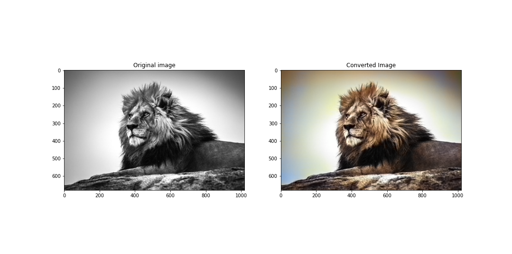

👋 Hello

# Image Colorization with Deep Neural Network

This Deep Learning Implementation aims to provide colorizing black & white images with Python, and further more the same technique can also be used for video colorization.

In image colorization, we take a black and white image as input and produce a colored image. We will solve this with OpenCV deep neural network.

# Origin of the Image Colorization Technique

The technique we will be covering orginated from the `Zhang et al.’s 2016 ECCV paper`.

Prefer to the link --> http://richzhang.github.io/colorization/

In the paper he explained that the previous approaches to black and white image colorization relied on manual human annotation and often produced desaturated results that were not “believable” as true colorizations.

Zhang et al. decided to attack the problem of image colorization by using Convolutional Neural Networks to “hallucinate” what an input grayscale image would look like when colorized.

To train the network Zhang et al. started with the ImageNet dataset and converted all images from the RGB color space to the Lab color space.

# Visualization as layers --> 

## Lab Color Space:

Like RGB, Lab is another color space. It is also three channel color space like RGB where the channels are:

  - `L channel`: This channel represents the Lightness
  - `a channel`: This channel represents green-red
  - `b channel`: This channel represents blue-yellow

Since the L channel encodes only the intensity, we can use the L channel as our grayscale input to the network.

From there the network must learn to predict the a and b channels. Given the input L channel and the predicted ab channels we can then form our final output image.

